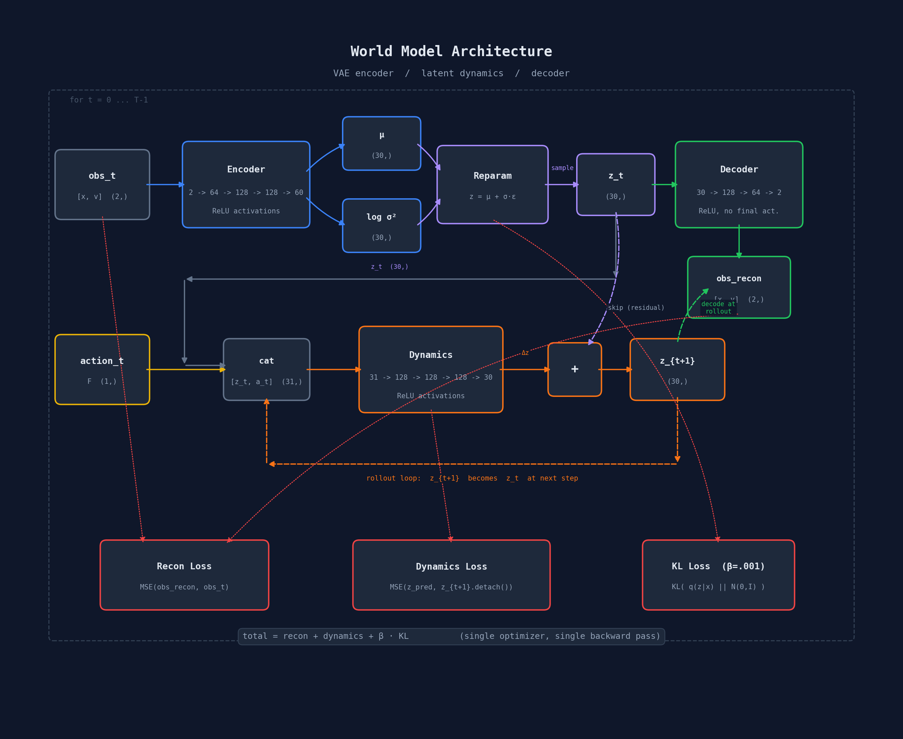
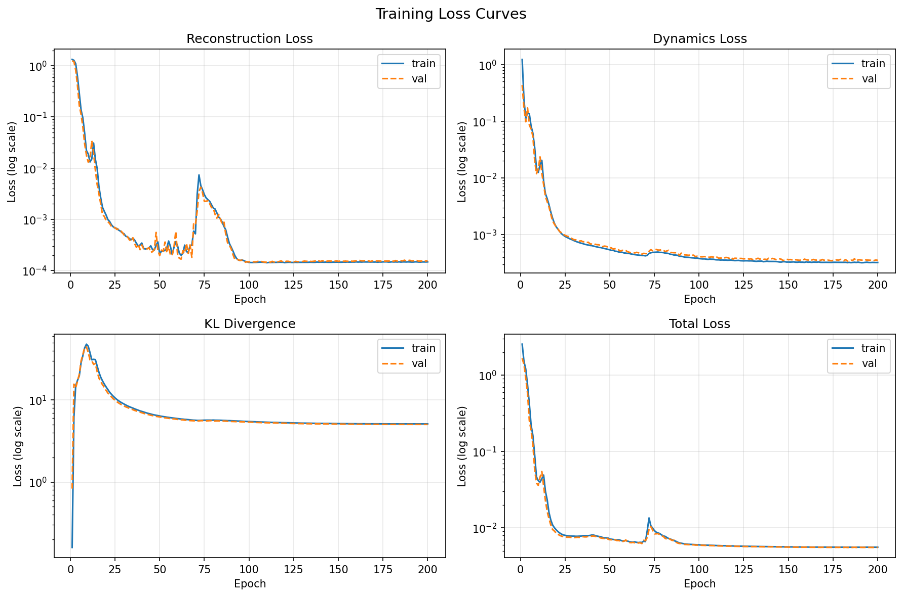
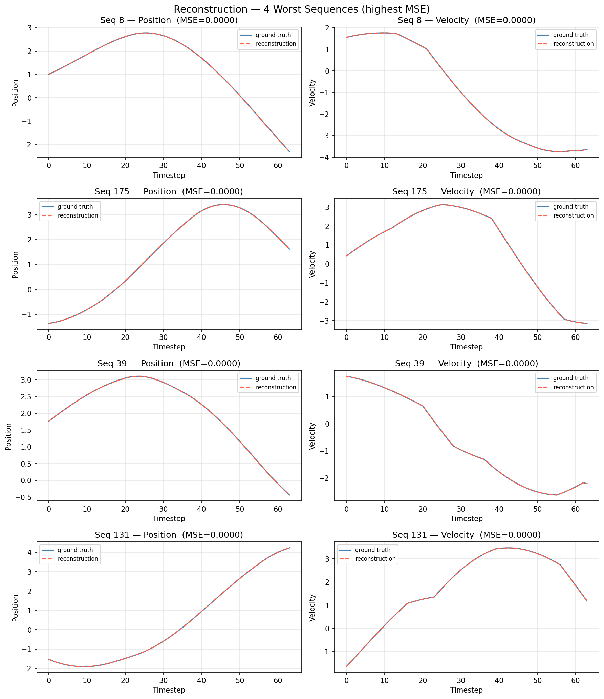
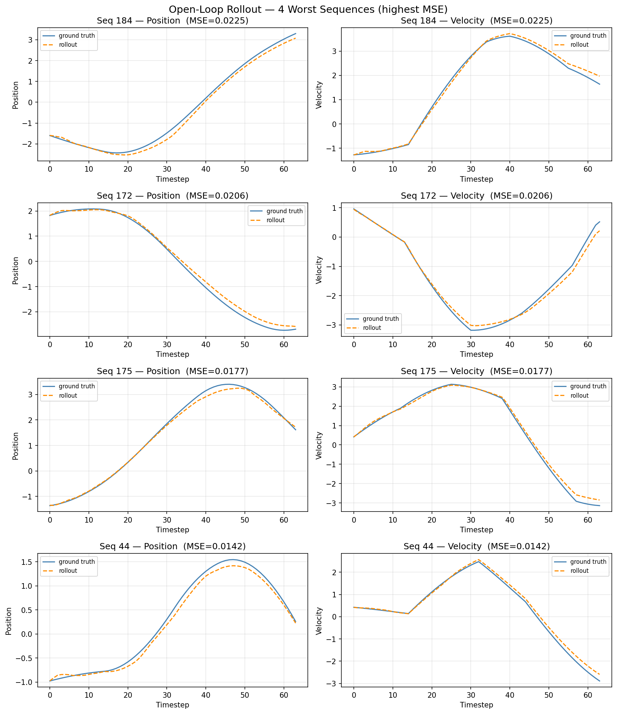
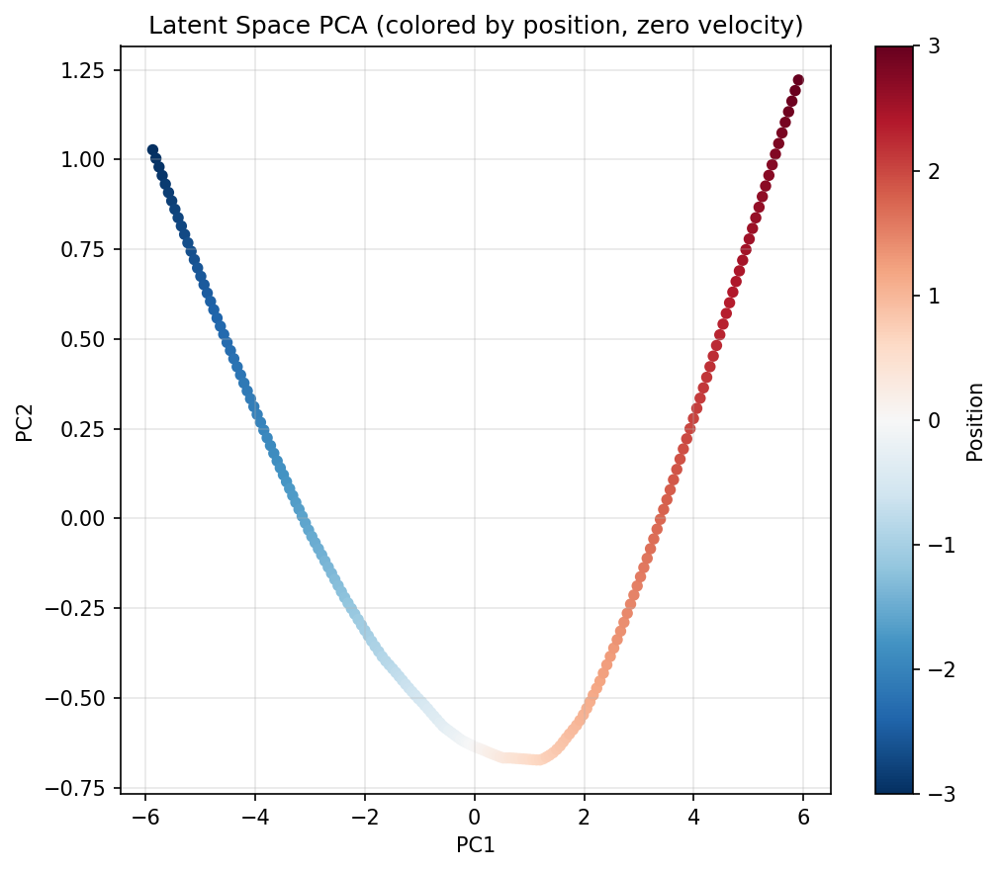

# wrld : simple toy "world" model  
I wanted to see if i could simulate a spring mass damper using a simple world model, end to end, and as simple as possible just to understand what was going on.

## to run
1. you will need `uv`, found [here](https://docs.astral.sh/uv/getting-started/installation/)
2. on linux / windows, `uv` will install the CUDA 12.6 pytorch wheel from the pytorch index. on macos, it will install the standard pytorch wheel from pypi instead.
3. `uv sync`
4. `uv run scripts/train.py`

it'll generate all the worst case loss and reconstruction curves, along with the loss curves.

### device selection
default: `uv run scripts/train.py`

optional override: `WRLD_DEVICE=auto|cuda|mps|cpu`

examples:

- `uv run scripts/train.py`
- `WRLD_DEVICE=mps uv run scripts/train.py`
- `WRLD_DEVICE=cpu uv run scripts/train.py`

## plots
### architecture
so heres a quick overview of the system architecture, i know its a little bit of a mess. courtesy of claude, i am no graphic designer.

it boils down to an encoder -> latent dynamics model -> deccoder, but if theoretically your rollouts can live in the latent space as you add your action vector directly to the latent vector, thus removing the lossy encoder + decoder step.

### loss

not much to be said, but interestingly if you remove the velocity from the observed state it still converges to a simiarly low loss.
definitions:
reconstruction loss -> covers the encoder / decoder effectiveness at reconstructing the original state, no transformation applied.
dynamics loss -> covers how good (or bad) the latent dynamics model is 
KL loss -> tries to keep the latent representation dense and meaningful, rather than overfitting.

### worst case reconstructions

not much to see here, the reconstruction was nailing it

### worst case rollouts

performance seems to degrade as you hit timestep 30 in worst cases, and model seems to do poorly for transient loading / huge changes in acceleration, as seen with seq 46 and 153. might just be issues of out of domain data, but we shall see

### latent PCA

indicates how well the latent representation holds for the space, if its sporadic / not a smooth curve from red to blue, then something fucked up

if you have any reccomendations or notice any big errors, please feel free to open a PR :)
